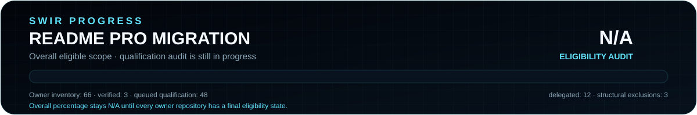

# SWIR README PRO Migration — Status

Documentation migration ledger for existing SWIR projects. This is **README migration progress**, not application development, release readiness or runtime verification.

Canonical standards: [SWIR README PRO v2](SWIR-README-STANDARD.md) · [SWIR Progress SVG PRO](SWIR-PROGRESS-STANDARD.md).

<!-- MIGRATION-METRICS owner=66 verified=12 queued=38 blocked=1 delegated=12 excluded=3 priority_verified=12 priority_total=13 eligibility=INCOMPLETE -->

  

## Run status

| Item | Current state |
|---|---|
| Started | 2026-09-17 |
| Owner repositories discovered | **66**; repository search page 2 was empty for the discovery snapshot |
| Verified migrations | **12** — Image-To-Ico, IPTV-checker, Gist_manager, WojThom, PowerBookmark, InfoPulse-PL, WAV-to-MP3-converter, PolSilver_Bluetooth, FASTIPTVPlayer, Matrix_Windows_Commander, BackgroundPXR, SwirPhotoClean |
| SVG rollout verified | **12** — same repositories |
| Queued / qualification pending | **38** |
| Blocked | **1** — Aria2Gui; existing feature PR #1 edits README and application code |
| Delegated to dedicated active tasks | **12** |
| Structural exclusions recorded | **3** |
| Initial priority subset | **12 / 13 = 92.3% verified** |
| Overall migration percentage | **N/A** until every queued owner repository receives a final eligibility decision |
| Next priority | Initial priority subset is complete except blocked Aria2Gui; continue qualification with **Hex-kolor**, then Driver-tool and Youtube-VLC |
| Completion policy | Final eligibility audit → every eligible repo verified or explicitly excepted → final audit/report → disable only this migration task |

  

The mini bar above is **only the initial 13-repository priority subset**. It is not the overall migration percentage. The overall card stays **N/A** while discovered repositories still need a final eligibility decision.

## Status contract

- `queued`: repository is discovered but still needs qualification and/or migration work.
- `in_progress`: an actual migration branch/PR exists; record its link and exact head.
- `verified`: final README and required assets were read back on the default branch after the appropriate checks and merge.
- `blocked`: a concrete unresolved obstacle prevents a safe migration; record evidence and required action.
- `excluded`: outside migration scope with a specific reason; never counted as migrated.
- `delegated`: another active project task owns documentation changes; never counted as this task's verified migration.

A v2 marker, uploaded banner, open PR or green source CI alone does not prove a complete migration. Verify branding, paths, truthful claims, installation, release links, visible Search Keywords, SWIR footer and Progress SVG PRO state where applicable.

## Initial priority queue

| Order | Repository | State | Current evidence / next step |
|---|---|---|---|
| 1 | [Image-To-Ico](https://github.com/Swir/Image-To-Ico) | `verified` | README v2 via PR #1; SVG rollout via [PR #2](https://github.com/Swir/Image-To-Ico/pull/2), merged as `dba8219`. Main README/progress assets read back. |
| 2 | [IPTV-checker](https://github.com/Swir/IPTV-checker) | `verified` | [PR #2](https://github.com/Swir/IPTV-checker/pull/2) merged as `c1b113e`; PR CI passed; main README/progress assets read back. |
| 3 | [Gist_manager](https://github.com/Swir/Gist_manager) | `verified` | [PR #3](https://github.com/Swir/Gist_manager/pull/3) merged as `c22fde0`; PR CI passed; main README/progress assets read back. |
| 4 | [WojThom](https://github.com/Swir/WojThom) | `verified` | [PR #8](https://github.com/Swir/WojThom/pull/8) merged as `ba38c17`; root README rebuilt from current Android/web evidence; progress is N/A because no canonical roadmap exists. Docs-only change did not match application workflow paths; no app-CI success claimed. |
| 5 | [Aria2Gui](https://github.com/Swir/Aria2Gui) | `blocked` | Existing [feature PR #1](https://github.com/Swir/Aria2Gui/pull/1) changes README plus application/UI files. Migration deferred to avoid overwriting concurrent feature work. Required action: resolve that PR, then re-read fresh `main` and migrate. |
| 6 | [PowerBookmark](https://github.com/Swir/PowerBookmark) | `verified` | [PR #1](https://github.com/Swir/PowerBookmark/pull/1) merged as `64be655`; v2 README + SVG PRO read back. Corrected unsupported JSON-backup claim and documented broad permissions/custom-script safety. |
| 7 | [InfoPulse-PL](https://github.com/Swir/InfoPulse-PL) | `verified` | [PR #1](https://github.com/Swir/InfoPulse-PL/pull/1) merged as `1639025`; v2 README + SVG PRO read back. Preserved Polish app identity, v3.2.0 release facts and input-automation safety. |
| 8 | [WAV-to-MP3-converter](https://github.com/Swir/WAV-to-MP3-converter) | `verified` | [PR #1](https://github.com/Swir/WAV-to-MP3-converter/pull/1) merged as `5283cc87`; README v2 + SVG PRO read back. Preserved v1.0.0/FFmpeg facts and replaced unsupported AI-watermark/evasion claims with factual DSP limits. No PR CI workflow exists for docs; no green-CI claim. |
| 9 | [PolSilver_Bluetooth](https://github.com/Swir/PolSilver_Bluetooth) | `verified` | [PR #4](https://github.com/Swir/PolSilver_Bluetooth/pull/4) merged as `714e44bb`; PR CI run `35280673281` passed Python 3.10–3.14 plus Windows Qt smoke. README/card read back; authorized diagnostics boundary preserved. |
| 10 | [FASTIPTVPlayer](https://github.com/Swir/FASTIPTVPlayer) | `verified` | [PR #4](https://github.com/Swir/FASTIPTVPlayer/pull/4) merged as `3d996ef9`; PR CI run `35280688386` passed Python 3.10–3.14 plus Windows GUI smoke. README/card read back; public-proxy harvesting remains excluded. |
| 11 | [Matrix_Windows_Commander](https://github.com/Swir/Matrix_Windows_Commander) | `verified` | [PR #4](https://github.com/Swir/Matrix_Windows_Commander/pull/4) merged as `5402a9d`; CI run `35285949024` passed Python 3.10–3.14 plus Windows GUI smoke; main README/card read back; destructive one-click exclusions preserved. |
| 12 | [BackgroundPXR](https://github.com/Swir/BackgroundPXR) | `verified` | [PR #1](https://github.com/Swir/BackgroundPXR/pull/1) merged as `c640e8f`; Windows workflow run `35286106534` passed; main README read back; product progress remains N/A because roadmap directions have no reproducible denominator. |
| 13 | [SwirPhotoClean](https://github.com/Swir/SwirPhotoClean) | `verified` | [PR #1](https://github.com/Swir/SwirPhotoClean/pull/1) merged as `50f2d2a`; Windows workflow run `35286267897` passed tests/build/packaged EXE smoke. README/card read back. Progress is **6/7 = 85.7%** from the existing `STATUS.md` 1.0 acceptance checklist, not a subjective product estimate. |

## Complete owner inventory snapshot

The list below is the finite owner-level discovery snapshot. `queued` entries still require content, fork, safety, legal and project-state qualification before they become part of the final eligible-migration denominator.

| Repository | Default branch | State | Note |
|---|---|---|---|
| [Hex-kolor](https://github.com/Swir/Hex-kolor) | `main` | `queued` | qualification/readme audit pending |
| [swir.github.io](https://github.com/Swir/swir.github.io) | `main` | `excluded` | portfolio/status site, not a README migration target |
| [Aria2Gui](https://github.com/Swir/Aria2Gui) | `main` | `blocked` | feature PR #1 currently changes README + application code; defer migration |
| [Driver-tool](https://github.com/Swir/Driver-tool) | `main` | `queued` | qualification/readme audit pending |
| [Youtube-VLC](https://github.com/Swir/Youtube-VLC) | `main` | `queued` | qualification/readme audit pending |
| [Spamer](https://github.com/Swir/Spamer) | `main` | `queued` | eligibility/safety review required before any edit |
| [plugin.swir](https://github.com/Swir/plugin.swir) | `master` | `queued` | qualification/readme audit pending |
| [Image-To-Ico](https://github.com/Swir/Image-To-Ico) | `main` | `verified` | README v2 + SVG rollout verified on main |
| [Transformer-3-Pro-T303UA-i5-6200-hackintosh](https://github.com/Swir/Transformer-3-Pro-T303UA-i5-6200-hackintosh) | `main` | `queued` | qualification/readme audit pending |
| [Tank-Revival-Overdrive](https://github.com/Swir/Tank-Revival-Overdrive) | `main` | `delegated` | dedicated active development task |
| [InfoPulse-PL](https://github.com/Swir/InfoPulse-PL) | `main` | `verified` | README v2 + SVG rollout verified on main |
| [XBookmark](https://github.com/Swir/XBookmark) | `main` | `queued` | qualification/readme audit pending |
| [Worker-Time-list-generator](https://github.com/Swir/Worker-Time-list-generator) | `main` | `queued` | qualification/readme audit pending |
| [WojThom](https://github.com/Swir/WojThom) | `main` | `verified` | README v2 + SVG rollout verified on main |
| [keygenerator](https://github.com/Swir/keygenerator) | `main` | `queued` | purpose/safety review required before any edit |
| [Y6-gamestick](https://github.com/Swir/Y6-gamestick) | `main` | `excluded` | metadata reports size 0; do not invent a product |
| [SwirTube](https://github.com/Swir/SwirTube) | `main` | `queued` | qualification/readme audit pending |
| [Matrix_Windows_Commander](https://github.com/Swir/Matrix_Windows_Commander) | `main` | `verified` | README v2 + SVG rollout verified on main; PR #4 CI passed |
| [Swir](https://github.com/Swir/Swir) | `main` | `excluded` | profile repo; only migration standards/ledger/tooling are maintained here |
| [File.io_Downloaderup](https://github.com/Swir/File.io_Downloaderup) | `main` | `queued` | qualification/readme audit pending |
| [Nes_New_Life](https://github.com/Swir/Nes_New_Life) | `main` | `delegated` | dedicated active development task |
| [TimeListe-Generator](https://github.com/Swir/TimeListe-Generator) | `main` | `queued` | qualification/readme audit pending |
| [CyptoPriceWidget](https://github.com/Swir/CyptoPriceWidget) | `main` | `queued` | qualification/readme audit pending |
| [Matrix-Ajax-Chat](https://github.com/Swir/Matrix-Ajax-Chat) | `main` | `queued` | qualification/readme audit pending |
| [Ghos-DNS](https://github.com/Swir/Ghos-DNS) | `main` | `queued` | qualification/readme audit pending |
| [Torrent_downloader](https://github.com/Swir/Torrent_downloader) | `main` | `queued` | qualification/readme audit pending |
| [cda-pl](https://github.com/Swir/cda-pl) | `main` | `queued` | legal/content scope review required before any edit |
| [SwirPhotoClean](https://github.com/Swir/SwirPhotoClean) | `main` | `verified` | README v2 + SVG rollout verified on main; 1.0 acceptance SVG derived from STATUS.md 6/7 checklist |
| [Koder](https://github.com/Swir/Koder) | `main` | `queued` | qualification/readme audit pending |
| [BackgroundPXR](https://github.com/Swir/BackgroundPXR) | `main` | `verified` | README v2 + SVG rollout verified on main; PR #1 Windows workflow passed |
| [Gist_manager](https://github.com/Swir/Gist_manager) | `main` | `verified` | README v2 + SVG rollout verified on main |
| [Github-README-Generator](https://github.com/Swir/Github-README-Generator) | `main` | `queued` | qualification/readme audit pending |
| [watermark-remover](https://github.com/Swir/watermark-remover) | `main` | `queued` | qualification/readme audit pending |
| [FASTIPTVPlayer](https://github.com/Swir/FASTIPTVPlayer) | `main` | `verified` | README v2 + SVG rollout verified on main; PR #4 CI passed |
| [Grosz](https://github.com/Swir/Grosz) | `main` | `queued` | qualification/readme audit pending |
| [Py-Converter-to-exe](https://github.com/Swir/Py-Converter-to-exe) | `main` | `queued` | qualification/readme audit pending |
| [WAV-to-MP3-converter](https://github.com/Swir/WAV-to-MP3-converter) | `main` | `verified` | README v2 + SVG rollout verified on main; real v1.0.0 preserved |
| [Image-to-txt](https://github.com/Swir/Image-to-txt) | `main` | `queued` | qualification/readme audit pending |
| [Titanium-APK-Bulider](https://github.com/Swir/Titanium-APK-Bulider) | `main` | `queued` | qualification/readme audit pending |
| [PolSilver_Bluetooth](https://github.com/Swir/PolSilver_Bluetooth) | `main` | `verified` | README v2 + SVG rollout verified on main; PR #4 CI passed |
| [czatpythom](https://github.com/Swir/czatpythom) | `main` | `queued` | qualification/readme audit pending |
| [NeonShift-X](https://github.com/Swir/NeonShift-X) | `main` | `queued` | qualification/readme audit pending |
| [IPTV-checker](https://github.com/Swir/IPTV-checker) | `main` | `verified` | README v2 + SVG rollout verified on main |
| [ASCITEXT](https://github.com/Swir/ASCITEXT) | `main` | `queued` | qualification/readme audit pending |
| [Github_Webste](https://github.com/Swir/Github_Webste) | `main` | `queued` | qualification/readme audit pending |
| [Dreambox-scaner](https://github.com/Swir/Dreambox-scaner) | `main` | `queued` | qualification/readme audit pending |
| [PowerBookmark](https://github.com/Swir/PowerBookmark) | `main` | `verified` | README v2 + SVG rollout verified on main |
| [Torrent_downloaderv2](https://github.com/Swir/Torrent_downloaderv2) | `main` | `queued` | qualification/readme audit pending |
| [MacTrix](https://github.com/Swir/MacTrix) | `main` | `queued` | qualification/readme audit pending |
| [Dragon-DiskForge](https://github.com/Swir/Dragon-DiskForge) | `main` | `delegated` | dedicated active development task |
| [Konofix](https://github.com/Swir/Konofix) | `main` | `delegated` | dedicated active development task |
| [check-out-of-hell](https://github.com/Swir/check-out-of-hell) | `main` | `delegated` | dedicated active development task |
| [xADKiller](https://github.com/Swir/xADKiller) | `main` | `delegated` | dedicated active development task |
| [SWIR_OS](https://github.com/Swir/SWIR_OS) | `main` | `delegated` | dedicated active development task |
| [Czateria_PLUS_Android](https://github.com/Swir/Czateria_PLUS_Android) | `main` | `queued` | qualification/readme audit pending |
| [Matrix-czat-pythom](https://github.com/Swir/Matrix-czat-pythom) | `main` | `queued` | qualification/readme audit pending |
| [KaliPhoneStudio](https://github.com/Swir/KaliPhoneStudio) | `main` | `delegated` | dedicated active development task |
| [GTT](https://github.com/Swir/GTT) | `main` | `delegated` | dedicated active development task |
| [SwirEngine](https://github.com/Swir/SwirEngine) | `main` | `delegated` | dedicated active development task |
| [Ryzen-5-5600G-A320M-](https://github.com/Swir/Ryzen-5-5600G-A320M-) | `main` | `queued` | qualification/readme audit pending |
| [Procent-calkulator](https://github.com/Swir/Procent-calkulator) | `main` | `queued` | qualification/readme audit pending |
| [Swirui](https://github.com/Swir/Swirui) | `main` | `delegated` | dedicated active development task |
| [Ghost-APK-Builder](https://github.com/Swir/Ghost-APK-Builder) | `main` | `queued` | qualification/readme audit pending |
| [CrossAim_power](https://github.com/Swir/CrossAim_power) | `main` | `queued` | qualification/readme audit pending |
| [SwirPhoneOS](https://github.com/Swir/SwirPhoneOS) | `main` | `delegated` | dedicated active development task |
| [Multichain-Tracker](https://github.com/Swir/Multichain-Tracker) | `main` | `queued` | qualification/readme audit pending |

State totals are machine-checkable from `MIGRATION-METRICS`: **12 verified + 38 queued + 1 blocked + 12 delegated + 3 excluded = 66 owner repositories**.

## Work owned by other active tasks

The following are delegated rather than edited by this migration task: `SWIR_OS`, `SwirEngine`, `Swirui`, `SwirPhoneOS`, `KaliPhoneStudio`, `Dragon-DiskForge`, `GTT`, `Tank-Revival-Overdrive`, `Nes_New_Life`, `check-out-of-hell`, `Konofix` and `xADKiller`.

Their README/SVG compliance may be audited, but documentation edits must be left to the dedicated task while it remains active to avoid competing branches and stale rewrites.

## Verified migrations

| Repository | Merge / evidence | README v2 | SVG PRO | Verification note |
|---|---|---:|---:|---|
| Image-To-Ico | README PR #1; SVG PR #2 → `dba8219` | ✅ | ✅ | main read-back; docs path had no dedicated PR CI |
| IPTV-checker | PR #2 → `c1b113e` | ✅ | ✅ | migration CI passed; main read-back |
| Gist_manager | PR #3 → `c22fde0` | ✅ | ✅ | migration CI passed; main read-back |
| WojThom | PR #8 → `ba38c17` | ✅ | ✅ | main README/card read back; app workflows path-filtered, no app-CI claim |
| PowerBookmark | PR #1 → `64be655` | ✅ | ✅ | main README read back; release workflow does not run for docs paths |
| InfoPulse-PL | PR #1 → `1639025` | ✅ | ✅ | main README read back; existing workflows do not run for docs paths |
| WAV-to-MP3-converter | PR #1 → `5283cc87` | ✅ | ✅ | main README/card read back; no PR CI workflow; misleading AI-evasion claims removed from docs |
| PolSilver_Bluetooth | PR #4 → `714e44bb` | ✅ | ✅ | CI run `35280673281` passed Python 3.10–3.14 and Windows smoke; main read-back |
| FASTIPTVPlayer | PR #4 → `3d996ef9` | ✅ | ✅ | CI run `35280688386` passed Python 3.10–3.14 and Windows GUI smoke; main read-back |
| Matrix_Windows_Commander | PR #4 → `5402a9d` | ✅ | ✅ | CI run `35285949024` passed Python 3.10–3.14 + Windows GUI smoke; main README/card read back |
| BackgroundPXR | PR #1 → `c640e8f` | ✅ | ✅ | Windows workflow run `35286106534` passed; main README read back; no fabricated product percentage |
| SwirPhotoClean | PR #1 → `50f2d2a` | ✅ | ✅ | Windows workflow run `35286267897` passed tests/build/packaged EXE smoke; main README/card read back; 1.0 gate 6/7 from STATUS.md |

## Blockers

### Aria2Gui

`Aria2Gui` has an existing open [feature PR #1](https://github.com/Swir/Aria2Gui/pull/1) that modifies `README.md`, both language launchers, a shared UI module and workflow/startup files. It is intentionally **not** merged or rewritten by this documentation-only task.

Required action for this migration: allow the feature PR to be resolved by its owning work; afterward fetch fresh `main`, re-audit the resulting README/source/release state and perform the README v2 + SVG PRO migration from that state.

## Execution log

| Date | Work actually performed | Result |
|---|---|---|
| 2026-09-17 | Read canonical README v2 standard and created the migration queue/ledger. | Initial three-repository audit recorded. |
| 2026-09-17 | Migrated Image-To-Ico, IPTV-checker and Gist_manager; added SVG PRO rollout; completed owner inventory discovery of 66 repositories. | 3 verified; overall eligibility still incomplete. |
| 2026-09-17 | Migrated WojThom, PowerBookmark and InfoPulse-PL through dedicated documentation PRs; read final main files back. Audited Aria2Gui and found a conflicting open feature PR. Updated migration metrics and progress tooling to track blocked repositories explicitly. | 6 verified; 1 blocked; 44 queued; priority subset 6/13 = 46.2%; overall progress remains N/A. Next: WAV-to-MP3-converter. |
| 2026-09-18 | Migrated WAV-to-MP3-converter, PolSilver_Bluetooth and FASTIPTVPlayer through documentation-only PRs; added README PRO v2 heroes, truthful status/release documentation, Search Keywords, N/A product-progress SVGs and deterministic progress checks. Read final README/cards back from main. | 9 verified; 1 blocked; 41 queued; priority subset 9/13 = 69.2%; overall progress remains N/A. Next: Matrix_Windows_Commander. |
| 2026-09-18 | Migrated Matrix_Windows_Commander, BackgroundPXR and SwirPhotoClean through documentation-only PRs. All three PR workflows passed. Matrix and BackgroundPXR use truthful N/A product-progress SVGs because no canonical denominator exists; SwirPhotoClean uses its existing STATUS.md 1.0 acceptance checklist for a deterministic 6/7 = 85.7% gate. Final main README/progress assets were read back after merge. | 12 verified; 1 blocked; 38 queued; initial priority subset 12/13 = 92.3%; overall progress remains N/A. Next: Hex-kolor. |

Do not silently change the denominator. Any later `queued → excluded/delegated/verified/blocked` decision must update the inventory row, state totals, metrics marker and generated SVGs together. Disable only this migration task after every discovered repository has a final eligibility state and every eligible migration/SVG rollout is verified or explicitly excepted according to the completion policy.
