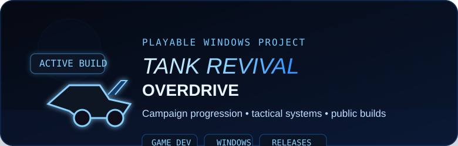
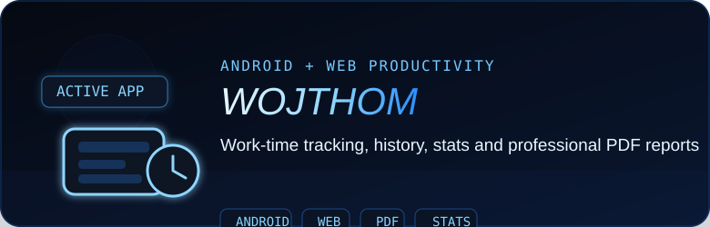
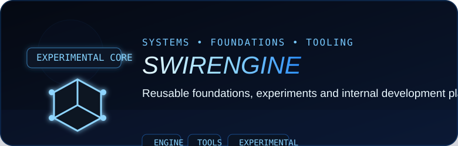
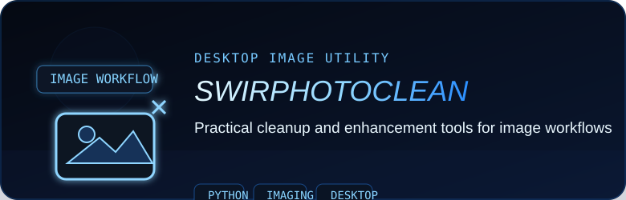

<div align="center">



<br><br>

<a href="https://github.com/Swir?tab=repositories"></a>
<a href="https://swir.github.io/"></a>
<a href="https://github.com/Swir/Tank-Revival-Overdrive/releases/latest"></a>

<br><br>

# SWIR

### Better Than Yesterday

**Ideas → Code → Reality**

`DEV` · `MUSIC` · `GAMES` · `AI` · `TOOLS`

</div>

---

## What I build

I build **desktop software, automation tools, Android/web apps and playable experiments**.

My goal is simple: take ideas and turn them into projects that can actually be **used, tested, shipped and improved**. Most of my work lives around **Python, Windows tooling, automation, game development, media utilities and AI-assisted workflows**.

```text
BUILD • CREATE • IMPROVE • REPEAT
```

---

## Featured Projects

<div align="center">

<a href="https://github.com/Swir/Tank-Revival-Overdrive"></a>
<a href="https://github.com/Swir/WojThom"></a>

<a href="https://github.com/Swir/SwirEngine"></a>
<a href="https://github.com/Swir/SwirPhotoClean"></a>

<br><br>

<strong><a href="https://github.com/Swir?tab=repositories">View all repositories →</a></strong>

</div>

---

## More Software

| Project | Purpose | Stack |
|---|---|---|
| [Aria2Gui](https://github.com/Swir/Aria2Gui) | Multi-connection desktop download manager | `Python` `CustomTkinter` `aria2c` |
| [InfoPulse-PL](https://github.com/Swir/InfoPulse-PL) | RSS / Atom / API information center | `Python` `APIs` |
| [PowerBookmark](https://github.com/Swir/PowerBookmark) | Browser automation and productivity tools | `JavaScript` `Manifest V3` |
| [Nes_New_Life](https://github.com/Swir/Nes_New_Life) | Retro development and HD workflow experiments | `Game Dev` `Unity` `Tooling` |
| [Image-To-Ico](https://github.com/Swir/Image-To-Ico) | Image → icon converter for Windows | `Python` `Windows` |
| [WAV-to-MP3-converter](https://github.com/Swir/WAV-to-MP3-converter) | Batch audio conversion utility | `Python` `Audio` |

---

## Toolbelt

<div align="center">


<br><br>


</div>

---

## Development Style

```text
IDEA → BUILD → TEST → RELEASE → IMPROVE
```

I prefer **working versions over endless prototypes**: ship something useful, learn from it, and make the next version better.

---

<details>
<summary><strong>GitHub activity & language statistics</strong></summary>

<br>

<div align="center">


<br>


<br><br>


</div>

</details>

---

<div align="center">

## SWIR

**Build. Create. Improve. Repeat.**

<sub>More than just code.</sub>

</div>
