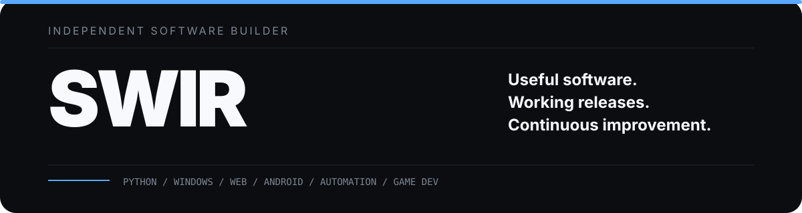
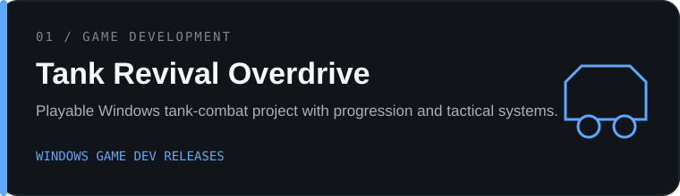
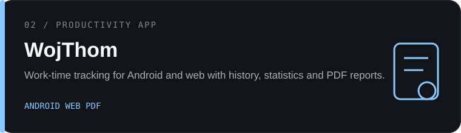
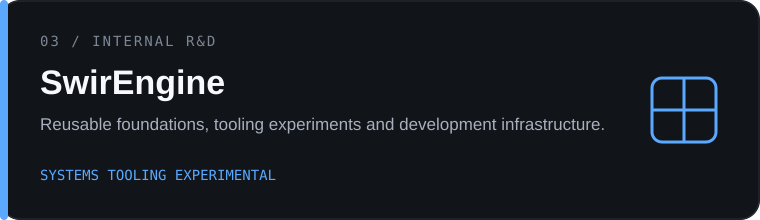
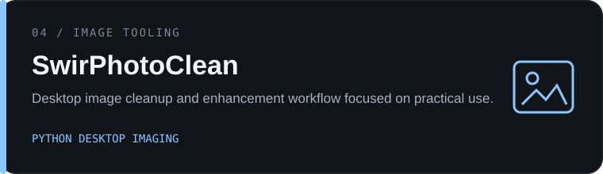

  

<a href="https://github.com/Swir?tab=repositories"><strong>Repositories</strong></a>
&nbsp;&nbsp;·&nbsp;&nbsp;
<a href="https://swir.github.io/"><strong>Portfolio</strong></a>
&nbsp;&nbsp;·&nbsp;&nbsp;
<a href="https://github.com/Swir/Tank-Revival-Overdrive/releases/latest"><strong>Latest Release</strong></a>

---

## Independent software builder

I design and build practical software across **desktop, automation, web, Android and game development**.

The common thread is simple: projects should have a clear purpose, become usable early, and improve through real-world iteration. I work mostly with **Python and Windows tooling**, while also building browser utilities, web interfaces, Android-oriented projects, media workflows and playable experiments.

**What matters most:** useful output, understandable interfaces, repeatable workflows and working releases.

---

## Selected work

  

<a href="https://github.com/Swir?tab=repositories"><strong>View all projects →</strong></a>

---

## Areas of work

<table>
<tr>
<td width="25%" valign="top">

### Desktop
Windows utilities, GUI applications, file processing and local productivity software.

</td>
<td width="25%" valign="top">

### Automation
Task automation, browser tooling, batch workflows and repetitive-process reduction.

</td>
<td width="25%" valign="top">

### Applications
Web interfaces, Android-oriented projects, reporting tools and offline-first workflows.

</td>
<td width="25%" valign="top">

### Experimental
Game development, reusable tooling, internal systems and AI-assisted workflows.

</td>
</tr>
</table>

---

## Selected utilities

| Project | Focus |
|---|---|
| [ARIA2 Ultimate PRO](https://github.com/Swir/Aria2Gui) | Desktop download management with aria2 |
| [InfoPulse PL](https://github.com/Swir/InfoPulse-PL) | RSS, Atom and API information aggregation |
| [NeonShift-X PowerBookmark](https://github.com/Swir/PowerBookmark) | Browser productivity and automation |
| [NES New Life](https://github.com/Swir/Nes_New_Life) | Retro-development and HD workflow experiments |
| [Image To ICO](https://github.com/Swir/Image-To-Ico) | Windows icon conversion utility |
| [WAV to MP3 Converter](https://github.com/Swir/WAV-to-MP3-converter) | Batch audio conversion workflow |

---

## Stack

  

`Python` &nbsp; `Kotlin` &nbsp; `JavaScript` &nbsp; `HTML/CSS` &nbsp; `PHP` &nbsp; `PowerShell` &nbsp; `Git` &nbsp; `Windows` &nbsp; `Linux`

---

## Build philosophy

**Start with the problem.**  
Understand what should become easier, faster or more useful.

**Ship a working version.**  
A real build provides better feedback than a perfect concept.

**Improve from evidence.**  
Every release is a baseline for the next one.

---

<strong>GitHub activity</strong>

 

  

---

### SWIR

**Useful software. Working releases. Continuous improvement.**

Independent development across tools, apps, automation and games.

