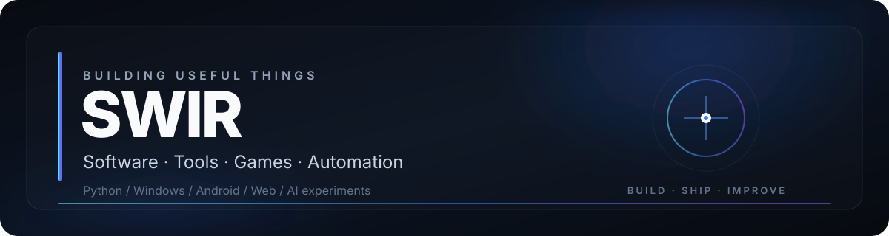

  

  

**I turn ideas into practical software, tools and playable projects.**

Python · Windows · Android · Web · Automation · Game Development · AI Experiments

---

## About

I build projects that solve real problems, automate repetitive work, explore new ideas or simply make technology more fun to use.

My work ranges from **desktop utilities and automation** to **Android/web apps, game development, image/audio tools and AI-assisted experiments**. I prefer shipping working versions, testing them in practice and improving them over time.

> **Better than yesterday. Build → ship → improve.**

---

## Featured projects

<table>
<tr>
<td width="50%" valign="top">

### [Tank Revival Overdrive](https://github.com/Swir/Tank-Revival-Overdrive)
Windows tank-combat project focused on playable builds, progression and tactical gameplay systems.

`GAME DEV` `WINDOWS` `PLAYABLE BUILDS`

[Latest release →](https://github.com/Swir/Tank-Revival-Overdrive/releases/latest)

</td>
<td width="50%" valign="top">

### [WojThom](https://github.com/Swir/WojThom)
Work-time application for Android and web with history, statistics and professional PDF reporting.

`ANDROID` `WEB` `PDF`

[View project →](https://github.com/Swir/WojThom)

</td>
</tr>
<tr>
<td width="50%" valign="top">

### [SwirEngine](https://github.com/Swir/SwirEngine)
My own development playground for experimenting with systems, tooling and reusable project foundations.

`ENGINE` `TOOLS` `EXPERIMENTAL`

[View project →](https://github.com/Swir/SwirEngine)

</td>
<td width="50%" valign="top">

### [SwirPhotoClean](https://github.com/Swir/SwirPhotoClean)
Desktop image-processing workflow focused on practical cleanup and enhancement tools.

`PYTHON` `DESKTOP` `IMAGING`

[View project →](https://github.com/Swir/SwirPhotoClean)

</td>
</tr>
</table>

### [Browse all repositories →](https://github.com/Swir?tab=repositories)

---

## More tools

| Project | What it does | Main stack |
|---|---|---|
| [ARIA2 Ultimate PRO](https://github.com/Swir/Aria2Gui) | Multi-connection desktop download manager | `Python` `CustomTkinter` `aria2c` |
| [InfoPulse PL](https://github.com/Swir/InfoPulse-PL) | RSS, Atom and API information center | `Python` `APIs` |
| [PowerBookmark](https://github.com/Swir/PowerBookmark) | Browser automation and productivity tooling | `JavaScript` `Manifest V3` |
| [NES New Life](https://github.com/Swir/Nes_New_Life) | Retro development and HD workflow experiments | `Game Dev` `Unity` `Tooling` |
| [Image To ICO](https://github.com/Swir/Image-To-Ico) | Image to Windows icon converter | `Python` `Windows` |
| [WAV to MP3 Converter](https://github.com/Swir/WAV-to-MP3-converter) | Batch audio conversion utility | `Python` `Audio` |

---

## Tech stack

  

`PYTHON` · `KOTLIN` · `JAVASCRIPT` · `HTML/CSS` · `PHP` · `POWERSHELL` · `GIT` · `WINDOWS` · `LINUX`

---

## GitHub activity

<strong>Show statistics</strong>

 

 

  

---

### SWIR

**Build useful things. Ship them. Make them better.**

If something here helps you, a ⭐ on the project is always appreciated.

