<div align="center">


<br>


<a href="https://github.com/Swir?tab=followers"></a>


<br><br>

<a href="https://github.com/Swir?tab=repositories"></a>
<a href="https://swir.github.io/"></a>

</div>

---

## About me

I build **practical software that people can actually run** — desktop utilities, Android and web apps, automation tools, game-development systems and AI-assisted experiments.

This profile is my public software lab. I prefer projects that evolve through real iterations, documentation, CI and releases instead of one-off demos.

```text
BUILD  →  TEST  →  FIX  →  RELEASE  →  IMPROVE
```

---

## Project radar

<div align="center">



</div>

The radar shows the areas I actively work in: **desktop software, automation, Android/web apps, game development and AI/R&D**.

---

## Now shipping

<table>
<tr>
<td width="33%" valign="top">

### 🛡️ [Tank Revival Overdrive](https://github.com/Swir/Tank-Revival-Overdrive)

**Current public release: v2.2.0** — a playable Windows x64 build with campaign progression, tactical combat systems and CI-driven releases.

<a href="https://github.com/Swir/Tank-Revival-Overdrive/releases/latest"></a>


</td>
<td width="33%" valign="top">

### ⏱️ [WojThom](https://github.com/Swir/WojThom)

Work-time application for **Android + Web** with persistent history, statistics, multilingual UI and professional PDF reporting.


</td>
<td width="33%" valign="top">

### 🎮 [NES New Life](https://github.com/Swir/Nes_New_Life)

Retro-game modernization lab focused on **safe tooling, HD-remaster workflows, Unity experiments and reproducible release pipelines** without distributing ROMs.


</td>
</tr>
</table>

---

## Featured projects

<table>
<tr>
<td width="50%" valign="top">

### ⚡ [ARIA2 Ultimate PRO](https://github.com/Swir/Aria2Gui)
Windows desktop GUI for **aria2c** with multi-connection downloads, torrents, magnet links and a cleaner download workflow.

`Python` `CustomTkinter` `aria2c` `Windows`

</td>
<td width="50%" valign="top">

### 🧹 [SwirPhotoClean](https://github.com/Swir/SwirPhotoClean)
Desktop image-cleaning workflow focused on practical photo processing and iterative UX improvements.

`Python` `Images` `Desktop GUI`

</td>
</tr>
<tr>
<td width="50%" valign="top">

### 🔖 [PowerBookmark](https://github.com/Swir/PowerBookmark)
Chrome/Chromium extension for reusable JavaScript snippets, domain targeting and portable JSON backups.

`JavaScript` `Chrome Extension` `Manifest V3`

</td>
<td width="50%" valign="top">

### 📡 [InfoPulse PL](https://github.com/Swir/InfoPulse-PL)
Desktop information center combining RSS, Atom and JSON API sources into one interface.

`Python` `CustomTkinter` `RSS` `APIs`

</td>
</tr>
<tr>
<td width="50%" valign="top">

### 🖼️ [Image To ICO](https://github.com/Swir/Image-To-Ico)
Desktop converter for turning common image formats into Windows `.ico` files.

`Python` `Images` `Windows`

</td>
<td width="50%" valign="top">

### 🎬 [SwirTube](https://github.com/Swir/SwirTube)
Terminal media workflow built around **yt-dlp**, FFmpeg, configuration and readable logs.

`Python` `yt-dlp` `FFmpeg` `Rich`

</td>
</tr>
</table>

<div align="center">

### [VIEW ALL REPOSITORIES →](https://github.com/Swir?tab=repositories)

</div>

---

## Explore by goal

| I want to… | Project | What it gives you |
|---|---|---|
| Download files faster | [ARIA2 Ultimate PRO](https://github.com/Swir/Aria2Gui#readme) | Desktop aria2 download manager |
| Create Windows icons | [Image To ICO](https://github.com/Swir/Image-To-Ico#readme) | PNG/JPG → ICO workflow |
| Convert audio | [WAV to MP3 Converter](https://github.com/Swir/WAV-to-MP3-converter#readme) | Batch audio conversion |
| Package Python apps | [Py Converter To EXE](https://github.com/Swir/Py-Converter-to-exe#readme) | Python → desktop package |
| Manage browser scripts | [PowerBookmark](https://github.com/Swir/PowerBookmark#readme) | Reusable JavaScript snippets |
| Track work hours | [WojThom](https://github.com/Swir/WojThom#readme) | Android/Web timesheets and PDF reports |
| Follow feeds and APIs | [InfoPulse PL](https://github.com/Swir/InfoPulse-PL#readme) | RSS/Atom/API dashboard |
| Explore game-development experiments | [NES New Life](https://github.com/Swir/Nes_New_Life#readme) | Modernization and tooling lab |

---

## Tech stack

<div align="center">


<br><br>

`PYTHON` • `KOTLIN` • `JAVASCRIPT` • `AUTOMATION` • `DESKTOP GUI` • `ANDROID` • `WEB` • `GAME DEV` • `AI` • `NETWORKING`

</div>

---

## How I build

<table>
<tr>
<td width="25%" align="center"><strong>01 — BUILD</strong><br><sub>Turn the idea into working code</sub></td>
<td width="25%" align="center"><strong>02 — VALIDATE</strong><br><sub>Test behavior, CI and packaging</sub></td>
<td width="25%" align="center"><strong>03 — RELEASE</strong><br><sub>Ship a usable build when ready</sub></td>
<td width="25%" align="center"><strong>04 — ITERATE</strong><br><sub>Improve from real feedback</sub></td>
</tr>
</table>

---

<details>
<summary><strong>GitHub statistics</strong></summary>

<br>

<div align="center">


<br>


<br><br>


</div>

</details>

---

## Contributions and feedback

Bug reports, useful feature ideas, testing feedback and pull requests are welcome. If you report a bug, please include your operating system, app version, reproduction steps and the full error message when possible.

<div align="center">

<br>

**If one of my projects is useful to you, consider starring that repository or following [@Swir](https://github.com/Swir).**

<br>

<a href="https://github.com/Swir?tab=repositories"></a>

</div>
