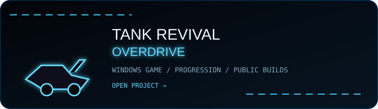
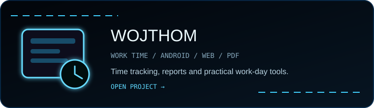
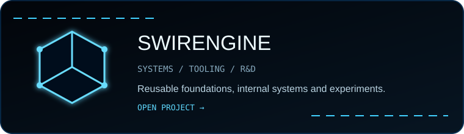
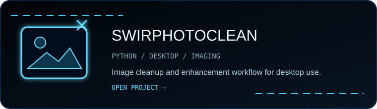

<div align="center">



<a href="https://github.com/Swir?tab=repositories"></a>
<a href="https://swir.github.io/"></a>
<a href="https://github.com/Swir/Tank-Revival-Overdrive/releases/latest"></a>

<br><br>


</div>


## About

I build projects that move from **idea to working release** fast, then evolve through testing, real use and iteration.

My main territory is **Python, Windows desktop software and automation**, with projects extending into **Android, web, browser tooling, image/audio workflows, AI-assisted systems and game development**.

```text
PROBLEM  →  BUILD  →  TEST  →  RELEASE  →  EVOLVE
```

> **Useful first. Working fast. Better every version.**


## Main Projects

<div align="center">

<a href="https://github.com/Swir/Tank-Revival-Overdrive"></a>
<a href="https://github.com/Swir/WojThom"></a>

<a href="https://github.com/Swir/SwirEngine"></a>
<a href="https://github.com/Swir/SwirPhotoClean"></a>

<a href="https://github.com/Swir?tab=repositories"><strong>VIEW ALL PROJECTS →</strong></a>

</div>


## Systems I Build

| Area | What I work on |
|---|---|
| **Desktop / Windows** | Python GUI software, utilities, file processing, local tools and Windows workflows |
| **Automation** | Batch processing, repetitive-task reduction, browser tooling and scripted workflows |
| **Applications** | Web interfaces, Android-oriented projects, reports and offline-first utilities |
| **Games** | Playable Windows builds, progression systems, tools and experiments |
| **Media** | Image cleanup, conversion, audio processing and FFmpeg-based workflows |
| **AI / R&D** | AI-assisted development, internal systems and experimental tooling |

## More Software

| Project | Purpose |
|---|---|
| [ARIA2 Ultimate PRO](https://github.com/Swir/Aria2Gui) | Multi-connection desktop download manager built around aria2 |
| [InfoPulse PL](https://github.com/Swir/InfoPulse-PL) | RSS, Atom and API-based information center |
| [NeonShift-X PowerBookmark](https://github.com/Swir/PowerBookmark) | Browser productivity and automation tooling |
| [NES New Life](https://github.com/Swir/Nes_New_Life) | Retro-development and HD workflow experiments |
| [Image To ICO](https://github.com/Swir/Image-To-Ico) | Windows icon conversion utility |
| [WAV to MP3 Converter](https://github.com/Swir/WAV-to-MP3-converter) | Batch WAV-to-MP3 conversion workflow |


## Stack

<div align="center">


<br>

`PYTHON` · `WINDOWS` · `JAVASCRIPT` · `KOTLIN` · `HTML/CSS` · `POWERSHELL` · `GIT` · `FFMPEG` · `ARIA2`

</div>


## Operating Mode

| 01 | 02 | 03 |
|---|---|---|
| **BUILD** | **RELEASE** | **EVOLVE** |
| Start with a real problem and get to a working version fast. | A usable build beats a perfect idea that never ships. | Every release becomes the starting point for the next one. |

## ⚡ GitHub Activity

<div align="center">


<br><br>

### `PIXEL TANK PATROL // LIVE`

<sub>REAL CONTRIBUTIONS AS TARGETS · AIM → FIRE → CLEAR · INFINITE ANIMATION</sub>

<br><br>


<br>

<sub>Continuous playback · Data sync scheduled every 5 min (GitHub delays possible) · <a href="https://raw.githubusercontent.com/Swir/Swir/main/assets/github-pixel-tank-patrol-still.svg">Static view</a></sub>

</div>


<div align="center">

### `SWIR // FULL POWER MODE`

## BUILD WHAT SHOULD EXIST.

**Software · Automation · Applications · Games · Experiments**

<sub>Better than yesterday.</sub>

</div>
