<div align="center">



<br>

<a href="https://github.com/Swir?tab=repositories"></a>
<a href="https://swir.github.io/"></a>
<a href="https://github.com/Swir/Tank-Revival-Overdrive/releases/latest"></a>

<br><br>

`BETTER THAN YESTERDAY // IDEAS → CODE → REALITY`

</div>

---

## // OPERATOR PROFILE

I build **software, tools and playable projects** with a focus on practical results: desktop apps, automation, Android/web solutions, game development, AI experiments and creative tech.

This profile is the public command center for the projects I actively improve, test and release.

```text
STATUS      : ONLINE
PRIMARY     : PYTHON / WINDOWS / AUTOMATION
SECONDARY   : GAME DEV / ANDROID / WEB / AI / AUDIO
LOOP        : IDEA → BUILD → TEST → SHIP → IMPROVE
```

---

<div align="center">

</div>

---

## // ACTIVE MISSIONS

<table>
<tr>
<td width="33%" valign="top">

### [TANK REVIVAL OVERDRIVE](https://github.com/Swir/Tank-Revival-Overdrive)
Playable Windows tank-combat project with campaign progression, tactical systems and public builds.

<a href="https://github.com/Swir/Tank-Revival-Overdrive/releases/latest"></a>

</td>
<td width="33%" valign="top">

### [WOJTHOM](https://github.com/Swir/WojThom)
Android + Web work-time app with history, statistics and PDF reporting.

`ANDROID` `WEB` `PDF`

</td>
<td width="33%" valign="top">

### [NES NEW LIFE](https://github.com/Swir/Nes_New_Life)
Retro dev lab focused on tooling, HD workflows and reproducible game-development experiments.

`GAME DEV` `UNITY` `TOOLING`

</td>
</tr>
</table>

---

## // LOADOUT

| System | Function | Stack |
|---|---|---|
| [ARIA2 Ultimate PRO](https://github.com/Swir/Aria2Gui) | Multi-connection desktop download manager | `Python` `CustomTkinter` `aria2c` |
| [SwirPhotoClean](https://github.com/Swir/SwirPhotoClean) | Desktop image-processing workflow | `Python` `Images` |
| [PowerBookmark](https://github.com/Swir/PowerBookmark) | Browser scripts, domain targeting and automation | `JavaScript` `Manifest V3` |
| [InfoPulse PL](https://github.com/Swir/InfoPulse-PL) | RSS, Atom and API information center | `Python` `APIs` |
| [Image To ICO](https://github.com/Swir/Image-To-Ico) | Image → Windows icon converter | `Python` `Windows` |
| [WAV to MP3 Converter](https://github.com/Swir/WAV-to-MP3-converter) | Batch audio conversion | `Python` `Audio` |

<div align="center">

**[ACCESS FULL ARSENAL →](https://github.com/Swir?tab=repositories)**

</div>

---

## // TECH ARSENAL

<div align="center">


<br><br>

`PYTHON` · `KOTLIN` · `JAVASCRIPT` · `POWERSHELL` · `WINDOWS` · `LINUX` · `GIT` · `GITHUB`

</div>

---

## // DEPLOYMENT LOOP

```text
[ IDEA ]
    ↓
[ BUILD ]
    ↓
[ TEST ]
    ↓
[ RELEASE ]
    ↓
[ IMPROVE ] ───────────────┐
    ↑                       │
    └───────────────────────┘
```

No endless prototype graveyard. If a project matters, I keep iterating until it becomes something useful.

---

<details>
<summary><strong>// TELEMETRY — GitHub activity & statistics</strong></summary>

<br>

<div align="center">


<br>


<br><br>


</div>

</details>

---

<div align="center">

### `SWIR // BUILD. SHIP. IMPROVE.`

**Better than yesterday.**

If one of my projects is useful to you, a ⭐ on that repository is appreciated.

</div>
