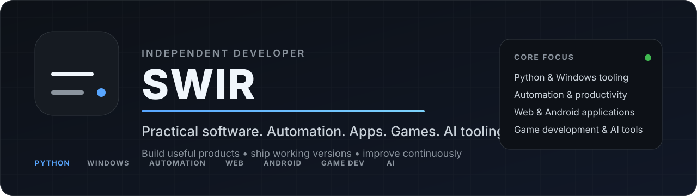
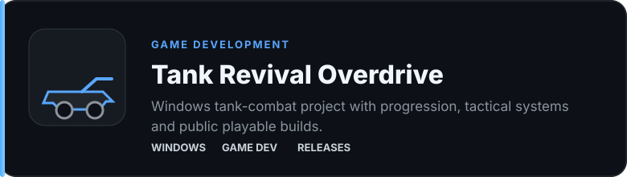
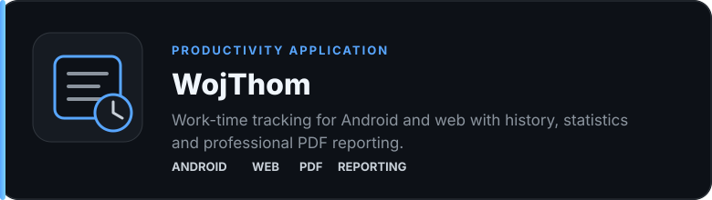
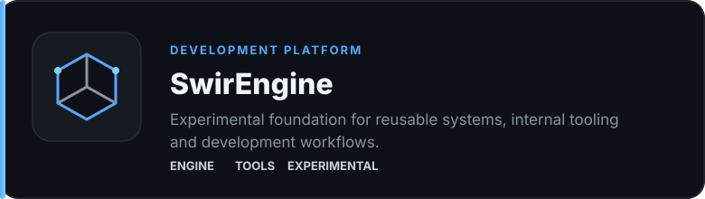
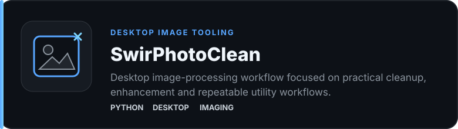

  

  

**Independent developer focused on practical software, automation, applications and playable products.**

---

## Profile

**SWIR** is my development workspace for software that is designed to be used, tested and improved in the real world.

My projects cover **Windows desktop utilities, workflow automation, Android and web applications, game development, image/audio tooling and AI-assisted workflows**. I prefer building working releases early, validating them in practice and iterating from there.

> **Focus:** practical functionality, clear interfaces, repeatable workflows and continuous improvement.

---

## Selected Work

  

<a href="https://github.com/Swir?tab=repositories"><strong>Browse all repositories →</strong></a>

---

## Core Capabilities

<table>
<tr>
<td width="50%" valign="top">

### Desktop & Windows

Python desktop applications, GUI tooling, local utilities, PowerShell workflows, file processing and Windows-focused automation.

**Primary tools:** `Python` `CustomTkinter` `PowerShell` `FFmpeg`

</td>
<td width="50%" valign="top">

### Automation & Tooling

Utilities that reduce repetitive work, browser tooling, batch processing, download workflows and task-oriented desktop software.

**Primary tools:** `Python` `JavaScript` `aria2` `GitHub Actions`

</td>
</tr>
<tr>
<td width="50%" valign="top">

### Web & Android

Responsive web interfaces, lightweight web applications, Android-oriented projects, reporting workflows and offline-first utilities.

**Primary tools:** `HTML` `CSS` `JavaScript` `Kotlin`

</td>
<td width="50%" valign="top">

### Games & Experimental Development

Playable prototypes, Windows builds, internal tooling, reusable foundations and experiments around game-development workflows.

**Primary tools:** `Unity` `Python` `Git` `Automation`

</td>
</tr>
</table>

---

## Additional Projects

| Project | Area | Description |
|---|---|---|
| [ARIA2 Ultimate PRO](https://github.com/Swir/Aria2Gui) | Desktop / Networking | Multi-connection desktop download manager built around aria2. |
| [InfoPulse PL](https://github.com/Swir/InfoPulse-PL) | Information / APIs | RSS, Atom and API-based information center. |
| [NeonShift-X PowerBookmark](https://github.com/Swir/PowerBookmark) | Browser Tooling | Browser productivity, scripts and automation workflows. |
| [NES New Life](https://github.com/Swir/Nes_New_Life) | Game Development | Retro-development, HD workflow and tooling experiments. |
| [Image To ICO](https://github.com/Swir/Image-To-Ico) | Desktop Utility | Image-to-Windows-icon conversion tool. |
| [WAV to MP3 Converter](https://github.com/Swir/WAV-to-MP3-converter) | Audio Utility | Batch WAV-to-MP3 conversion workflow. |

---

## Engineering Approach

<table>
<tr>
<td width="33%" valign="top">

### Problem First

Start with a concrete use case or workflow instead of adding features without a purpose.

</td>
<td width="33%" valign="top">

### Working Releases

A usable build creates better feedback than a prototype that never leaves development.

</td>
<td width="33%" valign="top">

### Continuous Improvement

Treat each release as a baseline for the next iteration rather than the final version.

</td>
</tr>
</table>

---

## Technology

  

---

## GitHub Activity

<strong>View contribution and language statistics</strong>

 

 

  

---

### SWIR

**Build useful software. Ship working versions. Improve continuously.**

Better than yesterday.

  

<a href="https://github.com/Swir?tab=repositories">Repositories</a> · <a href="https://swir.github.io/">Portfolio</a>

