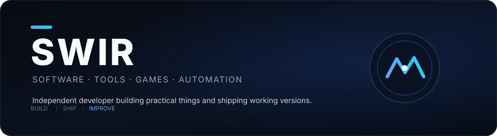
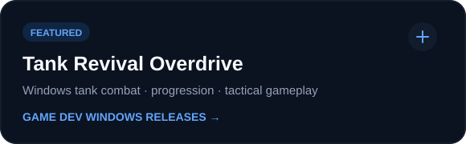
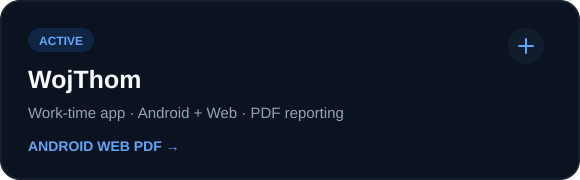
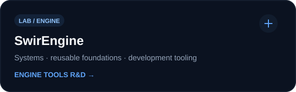
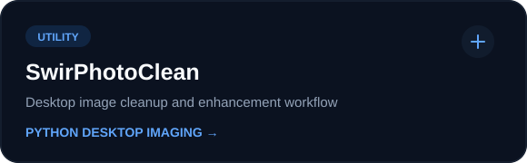

<div align="center">



<br><br>

<a href="https://github.com/Swir?tab=repositories"></a>
<a href="https://swir.github.io/"></a>
<a href="https://github.com/Swir/Tank-Revival-Overdrive/releases/latest"></a>

</div>

## What I build

I create **desktop software, automation tools, Android/web apps and playable experiments**. My projects usually start from a practical problem or an idea I want to test, then move quickly toward something that can actually be used, downloaded or played.

**Main focus:** Python · Windows tooling · automation · game development · Android/web · image/audio utilities · AI-assisted workflows

---

## Selected work

<div align="center">

<a href="https://github.com/Swir/Tank-Revival-Overdrive"></a>
<a href="https://github.com/Swir/WojThom"></a>

<a href="https://github.com/Swir/SwirEngine"></a>
<a href="https://github.com/Swir/SwirPhotoClean"></a>

<br><br>

<a href="https://github.com/Swir?tab=repositories"><strong>View the full project collection →</strong></a>

</div>

---

## More software

| Project | Purpose | Stack |
|---|---|---|
| [ARIA2 Ultimate PRO](https://github.com/Swir/Aria2Gui) | Multi-connection desktop download manager | `Python` `CustomTkinter` `aria2c` |
| [InfoPulse PL](https://github.com/Swir/InfoPulse-PL) | RSS, Atom and API information center | `Python` `APIs` |
| [NeonShift-X PowerBookmark](https://github.com/Swir/PowerBookmark) | Browser productivity and automation tools | `JavaScript` `Manifest V3` |
| [NES New Life](https://github.com/Swir/Nes_New_Life) | Retro development and HD workflow experiments | `Game Dev` `Unity` `Tooling` |
| [Image To ICO](https://github.com/Swir/Image-To-Ico) | Image → Windows icon converter | `Python` `Windows` |
| [WAV to MP3 Converter](https://github.com/Swir/WAV-to-MP3-converter) | Batch audio conversion utility | `Python` `Audio` |

---

## Toolbelt

<div align="center">


<br><br>


</div>

---

## Development style

```text
IDEA  →  BUILD  →  TEST  →  RELEASE  →  IMPROVE
                         ↑               │
                         └───────────────┘
```

I prefer **working iterations over permanent prototypes**: release something useful, learn from it, and make the next version better.

---

<details>
<summary><strong>GitHub activity & language statistics</strong></summary>

<br>

<div align="center">


<br>


<br><br>


</div>

</details>

---

<div align="center">

### SWIR

**Build useful things. Ship them. Make them better.**

<sub>If a project helps you, consider leaving it a ⭐.</sub>

</div>
