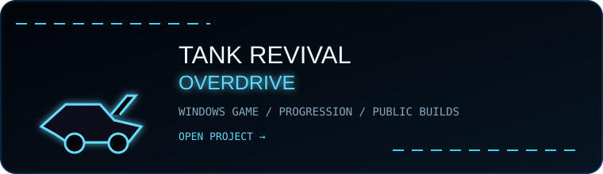
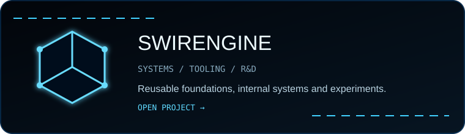
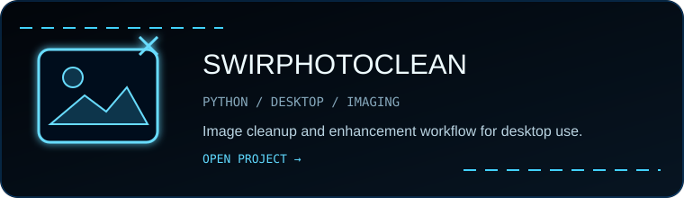

<div align="center">


<a href="https://github.com/Swir?tab=repositories"></a>
<a href="https://swir.github.io/"></a>
<a href="https://github.com/Swir/Tank-Revival-Overdrive/releases/latest"></a>

</div>


## About

I design and ship practical software with a focus on **Windows desktop applications, Python tooling and automation**.

My projects also extend into **Android, web applications, media workflows, developer tooling, AI-assisted systems and game development**. I prefer small, testable releases that can be validated in real use and improved iteratively.

```text
IDEA  →  BUILD  →  VERIFY  →  RELEASE  →  IMPROVE
```


## Selected Projects

<div align="center">

<a href="https://github.com/Swir/Tank-Revival-Overdrive"></a>
<a href="https://github.com/Swir/WojThom"></a>

<a href="https://github.com/Swir/SwirEngine"></a>
<a href="https://github.com/Swir/SwirPhotoClean"></a>

<a href="https://github.com/Swir?tab=repositories"><strong>View all repositories →</strong></a>

</div>


## Areas of Work

| Area | Focus |
|---|---|
| **Desktop / Windows** | GUI applications, utilities, local tools and file-processing workflows |
| **Automation** | Batch processing, repetitive-task reduction and scripted workflows |
| **Applications** | Web interfaces, Android-oriented projects and offline-first utilities |
| **Developer Tools** | Build tooling, diagnostics, conversion utilities and productivity software |
| **Media** | Image, audio and FFmpeg-based processing workflows |
| **R&D** | AI-assisted development, systems experiments and prototyping |

## Additional Projects

| Project | Purpose |
|---|---|
| [ARIA2 Ultimate PRO](https://github.com/Swir/Aria2Gui) | Desktop download manager built around aria2 |
| [InfoPulse PL](https://github.com/Swir/InfoPulse-PL) | RSS, Atom and API-based information center |
| [NeonShift-X PowerBookmark](https://github.com/Swir/PowerBookmark) | Browser productivity and automation tooling |
| [NES New Life](https://github.com/Swir/Nes_New_Life) | Retro-development and HD workflow experiments |
| [Image To ICO](https://github.com/Swir/Image-To-Ico) | Windows icon conversion utility |
| [WAV to MP3 Converter](https://github.com/Swir/WAV-to-MP3-converter) | Batch WAV-to-MP3 conversion workflow |


## Technology

<div align="center">


<br>

`Python` · `JavaScript` · `Kotlin` · `HTML/CSS` · `PHP` · `PowerShell` · `Git` · `FFmpeg` · `Windows` · `Linux`

</div>


## Development Approach

| Build | Verify | Release | Improve |
|---|---|---|---|
| Turn a concrete problem into a working implementation. | Test behavior, edge cases and real usage. | Publish a usable version with clear scope. | Iterate from feedback, evidence and regression testing. |

## GitHub Activity

<div align="center">


<br><br>


<br>

<sub>Self-hosted contribution visualization · refreshed automatically from GitHub activity · <a href="https://raw.githubusercontent.com/Swir/Swir/main/assets/github-robot-arm-factory-still.svg">static view</a></sub>

</div>


<div align="center">

**SWIR**

Software · Automation · Developer Tools · Experiments

<sub>Build useful things. Verify them. Improve them.</sub>

</div>
